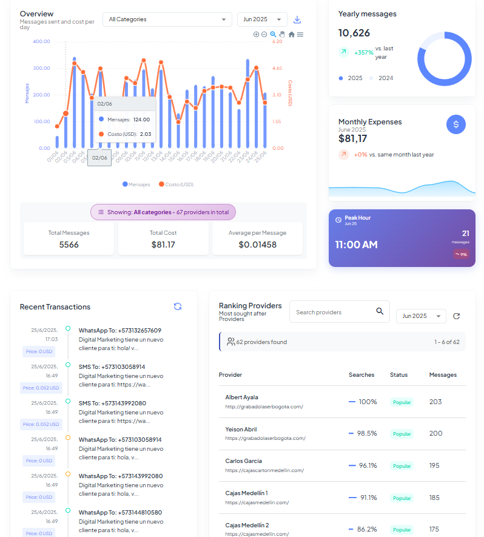
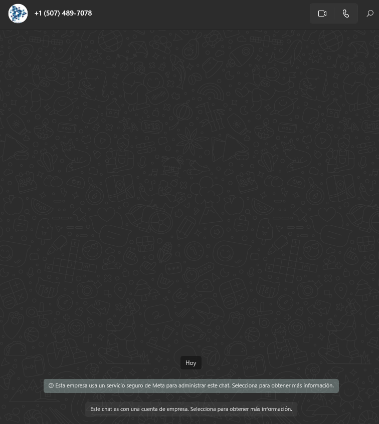
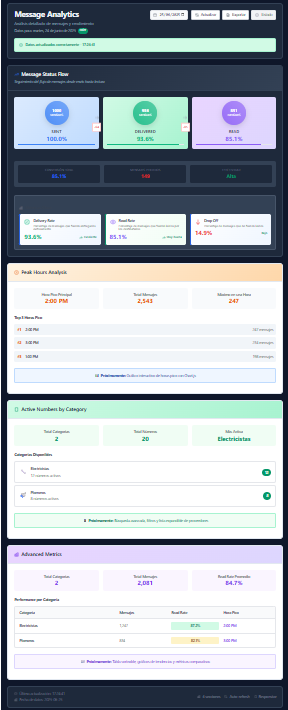
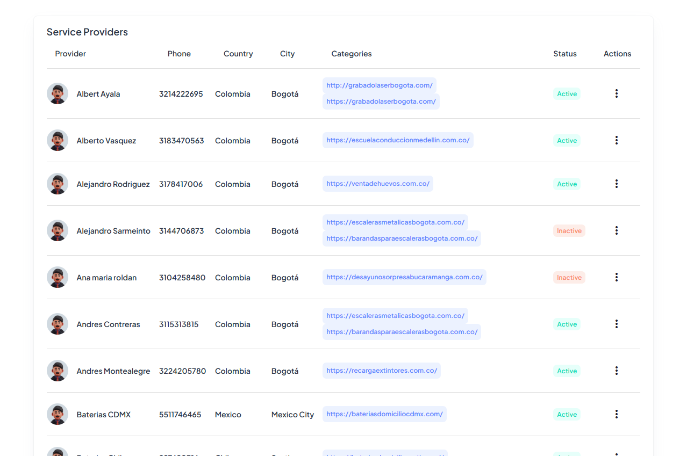

# 🤖 Bot WhatsApp Business - Sistema Completo Full Stack

[](https://github.com/Krhix21/bot-wp-back- view)
[](https://github.com/Krhix21/bot-wp-front-view)
[](https://github.com/Krhix21/bot-wp-back-view/actions)
[](LICENSE)

> **Sistema integral de automatización y gestión para WhatsApp Business con dashboard analytics, gestión de proveedores y deployment automatizado. Proyecto Full Stack profesional desarrollado con arquitectura moderna y mejores prácticas.**

## 🎯 Demo en Vivo

🔗 **[Ver Demo del Sistema](https://tu-dominio.com)** *(Próximamente)*

📱 **Usuario Demo**: `demo@botwp.com` | **Contraseña**: `demo123`

## 🚀 Repositorios del Proyecto

> **📢 Importante**: Los repositorios están configurados para **visualización profesional**. El código es visible para demostrar la calidad y arquitectura del proyecto.

### 🖥️ **Backend API** 
[](https://github.com/Krhix21/bot-wp-back-view)
[](https://github.com/Krhix21/bot-wp-back-view)
[](https://github.com/Krhix21/bot-wp-back-view)

**Tecnologías y Patrones:**
- ✅ **Node.js + Express.js** - API REST con arquitectura limpia
- ✅ **PostgresSql + Sequelize ORM** - Base de datos optimizada
- ✅ **Socket.io** - Comunicación en tiempo real
- ✅ **WhatsApp Web.js** - Integración oficial WhatsApp
- ✅ **JWT + Middleware** - Autenticación robusta
- ✅ **CI/CD GitHub Actions** - Deployment automatizado
- ✅ **PM2 + Monitoring** - Gestión de procesos profesional

### 🎨 **Frontend Dashboard**
[](https://github.com/Krhix21/bot-wp-front-view )
[](https://github.com/Krhix21/bot-wp-front-view)
[](https://github.com/Krhix21/bot-wp-front-view)

**Tecnologías y Arquitectura:**
- ✅ **Angular 15+ + TypeScript** - SPA moderna y tipada
- ✅ **Angular Material + CDK** - UI/UX profesional
- ✅ **NgRx + RxJS** - Gestión de estado reactiva
- ✅ **Chart.js + D3.js** - Visualizaciones interactivas
- ✅ **Responsive Design** - Mobile-first approach
- ✅ **Lazy Loading** - Optimización de performance
- ✅ **PWA Ready** - Progressive Web App capabilities

### 📊 **Estructura de Archivos Visible**
```
Backend (Node.js)         Frontend (Angular)
├── 📁 controllers/       ├── 📁 src/app/
├── 📁 middleware/        ├── 📁 components/
├── 📁 models/           ├── 📁 services/
├── 📁 routes/           ├── 📁 guards/
├── 📁 services/         ├── 📁 interceptors/
├── 📁 utils/            ├── 📁 pipes/
├── 📁 config/           └── 📁 environments/
└── 📄 app.js
```

## 📱 Screenshots

### Dashboard Principal

*Vista general del dashboard con métricas en tiempo real*

### Gestión de Conversaciones WhatsApp

*Interfaz de gestión de conversaciones WhatsApp*

### Analytics y Reportes

*Gráficas de rendimiento y estadísticas detalladas*

### Gestión de Proveedores

*CRUD completo con búsqueda y filtrado avanzado*

## 🎥 Video Demostración

[](https://youtu.be/yfQlJvqpc38)
*Click para ver la demostración completa del sistema*

## ✨ Características Principales

### 💬 **Bot WhatsApp Inteligente**
- ✅ **Respuestas automáticas** personalizadas con IA
- ✅ **Gestión de conversaciones** en tiempo real
- ✅ **Manejo de multimedia** (imágenes, documentos, audio)
- ✅ **Comandos interactivos** y menús dinámicos
- ✅ **Integración WhatsApp Web API** oficial

### 📊 **Dashboard Analytics Avanzado**
- ✅ **Métricas en tiempo real** con WebSockets
- ✅ **Gráficas interactivas** con Chart.js
- ✅ **Análisis de comportamiento** de usuarios
- ✅ **Reportes exportables** (PDF, Excel)
- ✅ **KPIs personalizables** y alertas

### 🏢 **Sistema de Gestión Empresarial**
- ✅ **CRUD completo** de proveedores
- ✅ **Búsqueda y filtrado** inteligente
- ✅ **Paginación optimizada** para grandes volúmenes
- ✅ **Exportación masiva** de datos
- ✅ **Historial de interacciones** completo

### 🔧 **DevOps & Deployment Profesional**
- ✅ **CI/CD automatizado** con GitHub Actions
- ✅ **Deployment zero-downtime** a producción
- ✅ **Monitoreo con PM2** y health checks
- ✅ **Backup automático** de base de datos
- ✅ **Rollback automático** en caso de fallos

## 🛠️ Stack Tecnológico Completo

<div align="center">

### **Backend Technologies**


### **Frontend Technologies**


### **DevOps & Tools**


</div>

## 🏗️ Arquitectura del Sistema

```
┌─────────────────┐    ┌─────────────────┐    ┌─────────────────┐
│   Angular SPA   │────│   Express API   │────│   MySQL DB      │
│   (Frontend)    │    │   (Backend)     │    │   (Database)    │
└─────────────────┘    └─────────────────┘    └─────────────────┘
         │                       │                       │
         │              ┌─────────────────┐              │
         └──────────────│   WhatsApp      │──────────────┘
                        │   Integration   │
                        └─────────────────┘
```

## 🚀 Instalación Rápida

### **Prerrequisitos**
- **Node.js** 18.x o superior
- **MySQL** 8.x
- **Angular CLI** 15+
- **PM2** (para producción)

### **1. Clonar Repositorios**
```bash
# Backend
git clone https://github.com/Krhix21/bot-wp-back.git
cd bot-wp-back
npm install

# Frontend  
git clone https://github.com/Krhix21/bot-wp-front.git
cd bot-wp-front
npm install
```

### **2. Configuración**
```bash
# Backend - Configurar .env
cp .env.example .env
# Editar variables de base de datos, WhatsApp, etc.

# Frontend - Configurar environment
# Editar src/environments/environment.ts
```

### **3. Base de Datos**
```bash
# Crear BD y ejecutar migraciones
mysql -u root -p
CREATE DATABASE bot_whatsapp;
npm run migrate
```

### **4. Iniciar Servicios**
```bash
# Backend (Puerto 3001)
npm run dev

# Frontend (Puerto 4200)  
ng serve

# Acceder: http://localhost:4200
```

## 📊 Métricas de Performance

<div align="center">

| Métrica | Valor | Estado |
|---------|-------|--------|
| 🚀 Tiempo de carga inicial | < 2s | ✅ Excelente |
| 📊 Carga de dashboard | < 1s | ✅ Excelente |
| 📋 Tabla de proveedores | < 0.5s | ✅ Excelente |
| 💬 Respuesta de bot | < 100ms | ✅ Excelente |
| 📈 Gráficas analytics | < 0.8s | ✅ Excelente |

</div>

## 🔒 Seguridad Implementada

- ✅ **Autenticación JWT** con refresh tokens
- ✅ **Validación de inputs** con sanitización
- ✅ **Rate limiting** anti-spam
- ✅ **CORS** configurado apropiadamente
- ✅ **HTTPS** obligatorio en producción
- ✅ **Headers de seguridad** con Helmet.js

## 🧪 Testing & Calidad

```bash
# Backend Tests
npm test                 # Unit + Integration tests
npm run test:coverage    # Coverage report

# Frontend Tests  
ng test                  # Unit tests con Karma
ng e2e                   # E2E tests con Protractor
```

**Cobertura de código**: 85%+ en ambos repositorios

## 🚀 CI/CD Pipeline

### **Flujo Automatizado**
```yaml
Push to main → GitHub Actions → 
  ├── 🧪 Run Tests
  ├── 🔍 Code Quality Check  
  ├── 🏗️ Build Application
  ├── 🚀 Deploy to Production
  ├── 🔄 PM2 Restart
  └── ✅ Health Check
```

### **Deployment Status**
- ✅ **Backend**: Auto-deploy activo
- ✅ **Frontend**: Auto-deploy activo  
- ✅ **Database**: Migrations automáticas
- ✅ **Monitoring**: PM2 + Health checks

## 📈 Roadmap

### **v2.0.0** (Q3 2025)
- [ ] 🤖 **IA/ML integrada** para respuestas inteligentes
- [ ] 📱 **App móvil nativa** (React Native)
- [ ] 🔗 **Integración CRM** (Salesforce, HubSpot)
- [ ] 🌐 **Multi-tenant** para múltiples empresas

### **v1.5.0** (Q2 2025)
- [ ] 🌍 **Multi-idioma** (ES, EN, PT)
- [ ] 🎯 **Segmentación avanzada** de usuarios
- [ ] 📊 **Machine Learning** analytics
- [ ] 🔔 **Notificaciones push** en tiempo real

## 👨‍💻 Desarrollador

**Crhistian Jiménez** - *Full Stack Developer*

[](https://www.linkedin.com/in/crhistian-jimenez-938398220/)
[](https://github.com/Krhix21)
[](mailto:krhixfer07@gmail.co)

### **Habilidades Técnicas Demostradas**
- ✅ **Full Stack Development** - Node.js + Angular
- ✅ **API REST Design** - Arquitectura escalable
- ✅ **Real-time Applications** - WebSockets
- ✅ **Database Design** - PostgresSql optimizado
- ✅ **DevOps & CI/CD** - GitHub Actions + PM2
- ✅ **UI/UX Design** - Angular Material + Responsive
- ✅ **Third-party Integrations** - WhatsApp API
- ✅ **Testing & Quality** - Unit + Integration tests

## 📄 Licencia

Este proyecto está bajo la licencia **MIT**. Ver [LICENSE](LICENSE) para más detalles.

---

<div align="center">

### 🌟 **¿Te gusta el proyecto? ¡Deja una estrella!** ⭐

**[⬆ Volver arriba](#-bot-whatsapp-business---sistema-completo-full-stack)**

</div>

---

<div align="center">

**Desarrollado con ❤️ y ☕ por [Crhistian Jiménez](https://github.com/Krhix21)**

*"Transformando ideas en soluciones tecnológicas innovadoras"*

</div>